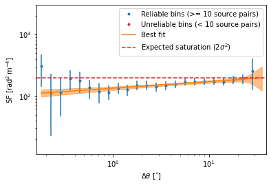
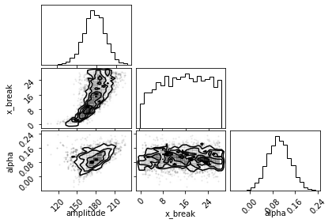
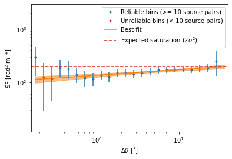
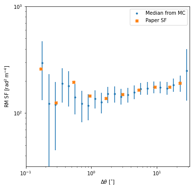

Example usage
=============
.. code:: ipython3

    %matplotlib inline
    from structurefunction import structure_function
    import numpy as np
    from astropy.table import Table
    from astropy.coordinates import SkyCoord
    from tqdm.auto import tqdm
    import matplotlib.pyplot as plt
    import astropy.units as u

The second-order structure function of rotation measure (RM) is given
by:

.. math::  SF_{\text{RM},\text{obs}}(\delta\theta) = \langle[\text{RM}{\theta} - \text{RM}(\theta+\delta\theta)]^2\rangle

That is, the ensemble average of the squared-difference in RM for
sources with angular seperation :math:`\delta\theta`. We also need to
correct for the impact of errors by:

.. math::  SF_{\text{RM}}(\delta\theta) = SF_{\text{RM},\text{obs}}(\delta\theta) - SF_{\sigma_\text{RM}}(\delta\theta)

See Haverkorn et al. 2004 (2004ApJ…609..776H) for details.

Here we’ll reproduce the results of Mao et al. 2010 (2010ApJ…714.1170M).

First, we can look at the expected results. I’ve pulled these data from
the paper’s plots using a web plot digitiser.

.. code:: ipython3

    mao_sf = 10**np.array([2.417894195735458,
                        2.097768739428083,
                        2.2926445508823967,
                        2.164149088774578,
                        2.1404402085381147,
                        2.176621779798478,
                        2.218782670913379,
                        2.2444782900152482,
                        2.2476963207124476,
                        2.2837806390213578,]) * (u.rad / u.m**2)**2
    mao_sep = 10**np.array([-0.7729091483767441,
                        -0.5386163683663935,
                        -0.2730532911440767,
                        -0.02550632317850443,
                        0.21819567988496358,
                        0.47213008276920787,
                        0.7173429798998987,
                        0.9643533199726302,
                        1.18882007856649,
                        1.3453070240944185,]) * u.deg

.. code:: ipython3

    plt.figure(figsize=(6,6))
    plt.plot(mao_sep, mao_sf, 'X', label='Paper SF')
    plt.xscale('log')
    plt.yscale('log')
    plt.ylim(10**1.5, 10**3)
    plt.xlim(10**-1,10**1.5)
    plt.legend()
    plt.xlabel(rf"$\Delta\theta$ [{mao_sep.unit:latex_inline}]")
    plt.ylabel(rf"RM SF [{mao_sf.unit:latex_inline}]")

.. parsed-literal::

    Text(0, 0.5, 'RM SF [$\\mathrm{rad^{2}\\,m^{-4}}$]')

Now we’ll start with the original data. We’ll convert the data to an
astropy table for convenience

.. code:: ipython3

    with open('apj343194t1_mrt.txt') as f:
        lines = f.readlines()
    for i, line in enumerate(tqdm(lines)):
        lines[i] = line.strip()
    coords, rms, e_rms, flags, incs = [], [], [], [], []
    for i, line in enumerate(tqdm(lines)):
        ra = f"{line[0:2]}h{line[3:5]}m{line[6:11]}s"
        #print(ra)
        dec = f"{line[12]}{line[13:15]}d{line[16:18]}m{line[19:24]}s"
        coord = SkyCoord(ra, dec)
        rm = float(line[39:42]) * (u.rad / u.m**2)
        e_rm = float(line[43:45]) * (u.rad / u.m**2)
        inc = line[63] == 'Y'
        incs.append(inc)
        try:
            flag = line[67]
        except:
            flag = None
        coords.append(coord)
        rms.append(rm)
        e_rms.append(e_rm)
        flags.append(flag)

    mao_rm_tab = Table()
    mao_rm_tab.add_column(coords, name='coordinates')
    mao_rm_tab.add_column(rms, name='RM')
    mao_rm_tab.add_column(e_rms, name='e_RM')
    mao_rm_tab.add_column(incs, name='included')
    mao_rm_tab.add_column(flags, name='flag')

    mao_rm_tab

.. parsed-literal::

      0%|          | 0/472 [00:00<?, ?it/s]

.. parsed-literal::

      0%|          | 0/472 [00:00<?, ?it/s]

.. raw:: html

    
<i>Table length=472</i>
    <table id="table7241452272" class="table-striped table-bordered table-condensed">
    <thead><tr><th>coordinates</th><th>RM</th><th>e_RM</th><th>included</th><th>flag</th></tr></thead>
    <thead><tr><th>deg,deg</th><th>rad / m2</th><th>rad / m2</th><th></th><th></th></tr></thead>
    <thead><tr><th>SkyCoord</th><th>float64</th><th>float64</th><th>bool</th><th>object</th></tr></thead>
    <tr><td>196.78470833333333,24.78352777777778</td><td>-3.0</td><td>4.0</td><td>True</td><td>None</td></tr>
    <tr><td>203.9505833333333,20.171111111111113</td><td>3.0</td><td>5.0</td><td>False</td><td>b</td></tr>
    <tr><td>201.06033333333332,22.220305555555555</td><td>-6.0</td><td>6.0</td><td>True</td><td>None</td></tr>
    <tr><td>201.07991666666663,22.233472222222222</td><td>0.0</td><td>6.0</td><td>True</td><td>None</td></tr>
    <tr><td>199.01816666666664,23.62713888888889</td><td>4.0</td><td>13.0</td><td>True</td><td>None</td></tr>
    <tr><td>200.20225,22.965194444444442</td><td>-6.0</td><td>8.0</td><td>True</td><td>None</td></tr>
    <tr><td>197.81804166666666,24.454333333333334</td><td>5.0</td><td>3.0</td><td>True</td><td>None</td></tr>
    <tr><td>203.60637499999996,21.167916666666667</td><td>-1.0</td><td>9.0</td><td>False</td><td>b</td></tr>
    <tr><td>196.91187499999998,25.055555555555557</td><td>-6.0</td><td>4.0</td><td>True</td><td>None</td></tr>
    <tr><td>...</td><td>...</td><td>...</td><td>...</td><td>...</td></tr>
    <tr><td>193.52904166666664,26.502466666666667</td><td>-5.0</td><td>2.0</td><td>False</td><td>a</td></tr>
    <tr><td>197.22479166666665,22.97161111111111</td><td>4.0</td><td>5.0</td><td>True</td><td>None</td></tr>
    <tr><td>196.72154166666664,23.542472222222223</td><td>-2.0</td><td>10.0</td><td>True</td><td>None</td></tr>
    <tr><td>199.7889583333333,20.89011111111111</td><td>1.0</td><td>6.0</td><td>True</td><td>None</td></tr>
    <tr><td>201.55124999999998,19.40825</td><td>2.0</td><td>11.0</td><td>False</td><td>b</td></tr>
    <tr><td>196.7925833333333,24.129166666666666</td><td>0.0</td><td>3.0</td><td>True</td><td>None</td></tr>
    <tr><td>199.27962499999998,22.589416666666665</td><td>-20.0</td><td>14.0</td><td>True</td><td>None</td></tr>
    <tr><td>200.54762499999998,21.80338888888889</td><td>12.0</td><td>6.0</td><td>True</td><td>None</td></tr>
    <tr><td>200.29674999999997,22.269972222222222</td><td>-1.0</td><td>4.0</td><td>True</td><td>None</td></tr>
    <tr><td>199.57758333333334,22.871305555555555</td><td>8.0</td><td>4.0</td><td>True</td><td>None</td></tr>
    </table>

f

Now we’ll define our own bin edges to compute a structure function

.. code:: ipython3

    start = -0.8
    stop = 1.5
    step = 0.1
    bins = 10**np.arange(start, stop+step, step)*u.deg

Here we compute the strcture function itself, including error
correction. We use 1000 samples of each distribution for error
propagation.

By setting ``show_plots=True`` three plots are shown. 1. An error-bar
plot of the SF. 2. A count of the number of source pairs per SF bin 3. A
structure function image showing the sampling from Monte-Carlo error
propagation

The ``structure_function`` function returns the centre of each bin, the
median value of each bin, the upper and lower error bounds, and the
number of sources in each bin.

By setting ``fit`` we use ``bilby`` to do a best-fit of the SF with a
broken power law. Here we’re using ``nestle`` to do the sampling. All
``**kwargs`` are passed onto the ``run_sampler`` method of ``bilby``.

.. code:: ipython3

    cbins, medians, err, count, result = structure_function(
        data=np.array(mao_rm_tab['RM'][mao_rm_tab['included']]) * u.rad / u.m**2,
        errors=np.array(mao_rm_tab['e_RM'][mao_rm_tab['included']]) * u.rad / u.m**2,
        coords=mao_rm_tab['coordinates'][mao_rm_tab['included']],
        samples=1000,
        bins=bins,
        show_plots=True,
        verbose=True,
        fit='bilby',
        nlive=400,
        sampler='nestle',
        model_name='broken_power_law',
    )

.. parsed-literal::

    2022-09-16 09:14:10.461 INFO structurefunction - structure_function: Sampling errors...
    2022-09-16 09:14:12.527 INFO structurefunction - structure_function: Getting data differences...
    2022-09-16 09:14:13.876 INFO structurefunction - structure_function: Getting data error differences...
    2022-09-16 09:14:15.241 INFO structurefunction - structure_function: Getting angular separations...
    2022-09-16 09:14:15.269 INFO structurefunction - structure_function: Computing SF...
    2022-09-16 09:14:16.936 INFO structurefunction - structure_function: Fitting SF with a broken power law...
    09:14 bilby INFO    : Running for label 'broken_power_law', output will be saved to 'outdir'
    09:14 bilby INFO    : Search parameters:
    09:14 bilby INFO    :   amplitude = Uniform(minimum=-63.26544230534412, maximum=470.26399685658464, name='amplitude', latex_label='$a$', unit=None, boundary=None)
    09:14 bilby INFO    :   x_break = Uniform(minimum=0.17782794100389226, maximum=28.18382931264449, name='x_break', latex_label='$\\theta_\\mathrm{break}$', unit=None, boundary=None)
    09:14 bilby INFO    :   alpha_1 = Uniform(minimum=-2, maximum=2, name='alpha_1', latex_label='$\\alpha_1$', unit=None, boundary=None)
    09:14 bilby INFO    :   alpha_2 = Uniform(minimum=-2, maximum=2, name='alpha_2', latex_label='$\\alpha_2$', unit=None, boundary=None)
    09:14 bilby INFO    : Single likelihood evaluation took 9.987e-05 s
    09:14 bilby WARNING : Supplied argument 'npool' not an argument of 'Nestle', removing.
    09:14 bilby WARNING : Supplied argument 'sample' not an argument of 'Nestle', removing.
    09:14 bilby INFO    : Using sampler Nestle with kwargs {'method': 'multi', 'npoints': 400, 'update_interval': None, 'npdim': None, 'maxiter': None, 'maxcall': None, 'dlogz': None, 'decline_factor': None, 'rstate': None, 'callback': <function print_progress at 0x1b096e700>, 'steps': 20, 'enlarge': 1.2}

.. parsed-literal::

    it=  3530 logz=-115.1097827102492

.. parsed-literal::

    09:14 bilby INFO    : Sampling time: 0:00:10.811501
    09:14 bilby INFO    : Summary of results:
    nsamples: 3931
    ln_noise_evidence:    nan
    ln_evidence: -114.815 +/-  0.127
    ln_bayes_factor:    nan +/-  0.127

    2022-09-16 09:14:29.269 INFO structurefunction - structure_function: Fitting results:
    2022-09-16 09:14:29.269 INFO structurefunction - structure_function: amplitude: 180 ± 20
    2022-09-16 09:14:29.270 INFO structurefunction - structure_function: x_break: 22 ± 4
    2022-09-16 09:14:29.271 INFO structurefunction - structure_function: alpha_1: 0.10 ± 0.04
    2022-09-16 09:14:29.272 INFO structurefunction - structure_function: alpha_2: 0 ± 1
    2022-09-16 09:14:29.272 INFO structurefunction - structure_function: Fit log evidence: -114.8152379924337 ± 0.12701652449377673

.. parsed-literal::

    Making hist plot:   0%|          | 0/24 [00:00<?, ?it/s]

.. image:: example_files/example_11_6.png

.. image:: example_files/example_11_7.png

.. parsed-literal::

    <Figure size 432x288 with 0 Axes>

.. image:: example_files/example_11_9.png

.. code:: ipython3

    cbins, medians, err, count, result = structure_function(
        data=np.array(mao_rm_tab['RM'][mao_rm_tab['included']]) * u.rad / u.m**2,
        errors=np.array(mao_rm_tab['e_RM'][mao_rm_tab['included']]) * u.rad / u.m**2,
        coords=mao_rm_tab['coordinates'][mao_rm_tab['included']],
        samples=1000,
        bins=bins,
        show_plots=True,
        verbose=True,
        fit='bilby',
        nlive=400,
        sampler='nestle',
        model_name='power_law',
    )

.. parsed-literal::

    2022-09-16 09:14:35.282 INFO structurefunction - structure_function: Sampling errors...
    2022-09-16 09:14:35.323 INFO structurefunction - structure_function: Getting data differences...
    2022-09-16 09:14:36.885 INFO structurefunction - structure_function: Getting data error differences...
    2022-09-16 09:14:38.499 INFO structurefunction - structure_function: Getting angular separations...
    2022-09-16 09:14:38.529 INFO structurefunction - structure_function: Computing SF...
    2022-09-16 09:14:40.027 INFO structurefunction - structure_function: Fitting SF with a power law...
    09:14 bilby INFO    : Running for label 'power_law', output will be saved to 'outdir'
    09:14 bilby INFO    : Search parameters:
    09:14 bilby INFO    :   amplitude = Uniform(minimum=-63.81717705255777, maximum=468.5890166911098, name='amplitude', latex_label='$a$', unit=None, boundary=None)
    09:14 bilby INFO    :   x_break = Uniform(minimum=0.17782794100389226, maximum=28.18382931264449, name='x_break', latex_label='$\\theta_\\mathrm{break}$', unit=None, boundary=None)
    09:14 bilby INFO    :   alpha = Uniform(minimum=-2, maximum=2, name='alpha', latex_label='$\\alpha$', unit=None, boundary=None)
    09:14 bilby INFO    : Single likelihood evaluation took 1.050e-04 s
    09:14 bilby WARNING : Supplied argument 'npool' not an argument of 'Nestle', removing.
    09:14 bilby WARNING : Supplied argument 'sample' not an argument of 'Nestle', removing.
    09:14 bilby INFO    : Using sampler Nestle with kwargs {'method': 'multi', 'npoints': 400, 'update_interval': None, 'npdim': None, 'maxiter': None, 'maxcall': None, 'dlogz': None, 'decline_factor': None, 'rstate': None, 'callback': <function print_progress at 0x1b096e700>, 'steps': 20, 'enlarge': 1.2}

.. parsed-literal::

    it=  3254 logz=-114.3524352848590

.. parsed-literal::

    09:14 bilby INFO    : Sampling time: 0:00:09.337694
    09:14 bilby INFO    : Summary of results:
    nsamples: 3655
    ln_noise_evidence:    nan
    ln_evidence: -113.927 +/-  0.125
    ln_bayes_factor:    nan +/-  0.125

    2022-09-16 09:14:50.400 INFO structurefunction - structure_function: Fitting results:
    2022-09-16 09:14:50.401 INFO structurefunction - structure_function: amplitude: 180 ± 20
    2022-09-16 09:14:50.402 INFO structurefunction - structure_function: x_break: 16 ± 8
    2022-09-16 09:14:50.403 INFO structurefunction - structure_function: alpha: 0.10 ± 0.04
    2022-09-16 09:14:50.403 INFO structurefunction - structure_function: Fit log evidence: -113.9273916449165 ± 0.1252873443614207

.. parsed-literal::

    Making hist plot:   0%|          | 0/24 [00:00<?, ?it/s]

.. image:: example_files/example_12_7.png

.. parsed-literal::

    <Figure size 432x288 with 0 Axes>

.. image:: example_files/example_12_9.png

Finally, we can compare our results to those from the original paper.

.. code:: ipython3

    plt.figure(figsize=(6,6), facecolor='w')
    plt.plot(cbins, medians, '.', label='Median from MC')
    plt.errorbar(cbins.value, medians, yerr=err, color='tab:blue', marker=None, fmt=' ', )#label = '16th to 84th percentile range')
    plt.plot(mao_sep, mao_sf, 'X', label='Paper SF')
    plt.xscale('log')
    plt.yscale('log')
    plt.ylim(10**1.5, 10**3)
    plt.xlim(10**-1,10**1.5)
    plt.legend()
    plt.xlabel(rf"$\Delta\theta$ [{mao_sep.unit:latex_inline}]")
    plt.ylabel(rf"RM SF [{mao_sf.unit:latex_inline}]")

.. parsed-literal::

    Text(0, 0.5, 'RM SF [$\\mathrm{rad^{2}\\,m^{-4}}$]')

