.. code:: ipython3

    %matplotlib inline
    from structurefunction import structure_function
    import numpy as np
    from astropy.table import Table
    from astropy.coordinates import SkyCoord
    from tqdm.auto import tqdm
    import matplotlib.pyplot as plt
    import astropy.units as u
    import os
    import shutil

The second-order structure function of rotation measure (RM) is given
by:

.. math::  SF_{\text{RM},\text{obs}}(\delta\theta) = \langle[\text{RM}{\theta} - \text{RM}(\theta+\delta\theta)]^2\rangle

That is, the ensemble average of the squared-difference in RM for
sources with angular seperation :math:`\delta\theta`. We also need to
correct for the impact of errors by:

.. math::  SF_{\text{RM}}(\delta\theta) = SF_{\text{RM},\text{obs}}(\delta\theta) - SF_{\sigma_\text{RM}}(\delta\theta) 

See Haverkorn et al. 2004 (2004ApJ…609..776H) for details.

Here we’ll reproduce the results of Mao et al. 2010 (2010ApJ…714.1170M).

First, we can look at the expected results. I’ve pulled these data from
the paper’s plots using a web plot digitiser.

.. code:: ipython3

    mao_sf = 10**np.array([2.417894195735458,
                        2.097768739428083,
                        2.2926445508823967,
                        2.164149088774578,
                        2.1404402085381147,
                        2.176621779798478,
                        2.218782670913379,
                        2.2444782900152482,
                        2.2476963207124476,
                        2.2837806390213578,]) * (u.rad / u.m**2)**2
    mao_sep = 10**np.array([-0.7729091483767441, 
                        -0.5386163683663935, 
                        -0.2730532911440767, 
                        -0.02550632317850443, 
                        0.21819567988496358, 
                        0.47213008276920787, 
                        0.7173429798998987, 
                        0.9643533199726302, 
                        1.18882007856649, 
                        1.3453070240944185,]) * u.deg

.. code:: ipython3

    plt.figure(figsize=(6,6))
    plt.plot(mao_sep, mao_sf, 'X', label='Paper SF')
    plt.xscale('log')
    plt.yscale('log')
    plt.ylim(10**1.5, 10**3)
    plt.xlim(10**-1,10**1.5)
    plt.legend()
    plt.xlabel(rf"$\Delta\theta$ [{mao_sep.unit:latex_inline}]")
    plt.ylabel(rf"RM SF [{mao_sf.unit:latex_inline}]")

.. parsed-literal::

    Text(0, 0.5, 'RM SF [$\\mathrm{rad^{2}\\,m^{-4}}$]')

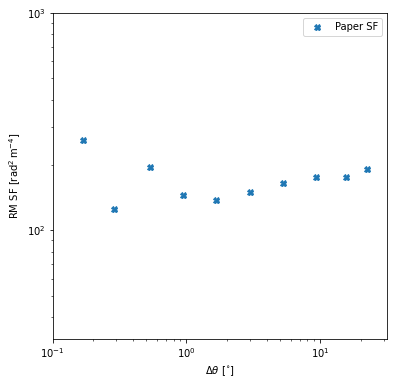

Now we’ll start with the original data. We’ll convert the data to an
astropy table for convenience

.. code:: ipython3

    with open('apj343194t1_mrt.txt') as f:
        lines = f.readlines()
    for i, line in enumerate(tqdm(lines)):
        lines[i] = line.strip()
    coords, rms, e_rms, flags, incs = [], [], [], [], []
    for i, line in enumerate(tqdm(lines)):
        ra = f"{line[0:2]}h{line[3:5]}m{line[6:11]}s"
        #print(ra)
        dec = f"{line[12]}{line[13:15]}d{line[16:18]}m{line[19:24]}s"
        coord = SkyCoord(ra, dec)
        rm = float(line[39:42]) * (u.rad / u.m**2)
        e_rm = float(line[43:45]) * (u.rad / u.m**2)
        inc = line[63] == 'Y'
        incs.append(inc)
        try:
            flag = line[67]
        except:
            flag = None
        coords.append(coord)
        rms.append(rm)
        e_rms.append(e_rm)
        flags.append(flag)
    
    mao_rm_tab = Table()
    mao_rm_tab.add_column(coords, name='coordinates')
    mao_rm_tab.add_column(rms, name='RM')
    mao_rm_tab.add_column(e_rms, name='e_RM')
    mao_rm_tab.add_column(incs, name='included')
    mao_rm_tab.add_column(flags, name='flag')
    
    mao_rm_tab

.. parsed-literal::

      0%|          | 0/472 [00:00<?, ?it/s]

.. parsed-literal::

      0%|          | 0/472 [00:00<?, ?it/s]

.. raw:: html

    
<i>Table length=472</i>
    <table id="table7271071504" class="table-striped table-bordered table-condensed">
    <thead><tr><th>coordinates</th><th>RM</th><th>e_RM</th><th>included</th><th>flag</th></tr></thead>
    <thead><tr><th>deg,deg</th><th>rad / m2</th><th>rad / m2</th><th></th><th></th></tr></thead>
    <thead><tr><th>SkyCoord</th><th>float64</th><th>float64</th><th>bool</th><th>object</th></tr></thead>
    <tr><td>196.78470833333333,24.78352777777778</td><td>-3.0</td><td>4.0</td><td>True</td><td>None</td></tr>
    <tr><td>203.9505833333333,20.171111111111113</td><td>3.0</td><td>5.0</td><td>False</td><td>b</td></tr>
    <tr><td>201.06033333333332,22.220305555555555</td><td>-6.0</td><td>6.0</td><td>True</td><td>None</td></tr>
    <tr><td>201.07991666666663,22.233472222222222</td><td>0.0</td><td>6.0</td><td>True</td><td>None</td></tr>
    <tr><td>199.01816666666664,23.62713888888889</td><td>4.0</td><td>13.0</td><td>True</td><td>None</td></tr>
    <tr><td>200.20225,22.965194444444442</td><td>-6.0</td><td>8.0</td><td>True</td><td>None</td></tr>
    <tr><td>197.81804166666666,24.454333333333334</td><td>5.0</td><td>3.0</td><td>True</td><td>None</td></tr>
    <tr><td>203.60637499999996,21.167916666666667</td><td>-1.0</td><td>9.0</td><td>False</td><td>b</td></tr>
    <tr><td>196.91187499999998,25.055555555555557</td><td>-6.0</td><td>4.0</td><td>True</td><td>None</td></tr>
    <tr><td>...</td><td>...</td><td>...</td><td>...</td><td>...</td></tr>
    <tr><td>193.52904166666664,26.502466666666667</td><td>-5.0</td><td>2.0</td><td>False</td><td>a</td></tr>
    <tr><td>197.22479166666665,22.97161111111111</td><td>4.0</td><td>5.0</td><td>True</td><td>None</td></tr>
    <tr><td>196.72154166666664,23.542472222222223</td><td>-2.0</td><td>10.0</td><td>True</td><td>None</td></tr>
    <tr><td>199.7889583333333,20.89011111111111</td><td>1.0</td><td>6.0</td><td>True</td><td>None</td></tr>
    <tr><td>201.55124999999998,19.40825</td><td>2.0</td><td>11.0</td><td>False</td><td>b</td></tr>
    <tr><td>196.7925833333333,24.129166666666666</td><td>0.0</td><td>3.0</td><td>True</td><td>None</td></tr>
    <tr><td>199.27962499999998,22.589416666666665</td><td>-20.0</td><td>14.0</td><td>True</td><td>None</td></tr>
    <tr><td>200.54762499999998,21.80338888888889</td><td>12.0</td><td>6.0</td><td>True</td><td>None</td></tr>
    <tr><td>200.29674999999997,22.269972222222222</td><td>-1.0</td><td>4.0</td><td>True</td><td>None</td></tr>
    <tr><td>199.57758333333334,22.871305555555555</td><td>8.0</td><td>4.0</td><td>True</td><td>None</td></tr>
    </table>

Now we’ll define our own bin edges to compute a structure function

.. code:: ipython3

    start = -0.8
    stop = 1.5
    step = 0.1
    bins = 10**np.arange(start, stop+step, step)*u.deg

Here we compute the strcture function itself, including error
correction. We use 1000 samples of each distribution for error
propagation.

By setting ``show_plots=True`` three plots are shown. 1. An error-bar
plot of the SF. 2. A count of the number of source pairs per SF bin 3. A
structure function image showing the sampling from Monte-Carlo error
propagation

The ``structure_function`` function returns the centre of each bin, the
median value of each bin, the upper and lower error bounds, and the
number of sources in each bin.

By setting ``fit`` we use ``bilby`` to do a best-fit of the SF with a
broken power law. Here we’re using ``nestle`` to do the sampling. All
``**kwargs`` are passed onto the ``run_sampler`` method of ``bilby``.

.. code:: ipython3

    # Clean up if a previous run was done
    if os.path.exists("outdir"):
        shutil.rmtree("outdir")

.. code:: ipython3

    sf_result, result = structure_function(
        data=np.array(mao_rm_tab['RM'][mao_rm_tab['included']]) * u.rad / u.m**2,
        errors=np.array(mao_rm_tab['e_RM'][mao_rm_tab['included']]) * u.rad / u.m**2,
        coords=mao_rm_tab['coordinates'][mao_rm_tab['included']],
        samples=1000,
        bins=bins,
        show_plots=True,
        verbose=True,
        fit='bilby',
        nlive=400,
        sampler='nestle',
        model_name='broken_power_law',
    )

.. parsed-literal::

    2022-11-07 14:03:13.640 INFO structurefunction - structure_function: Sampling errors...
    2022-11-07 14:03:17.396 INFO structurefunction - structure_function: Getting angular separations...
    2022-11-07 14:03:17.434 INFO structurefunction - structure_function: Computing SF...
    2022-11-07 14:03:31.302 INFO structurefunction - fit_data: Fitting SF with a broken power law...
    14:03 bilby INFO    : Running for label 'broken_power_law_2_point', output will be saved to 'outdir'
    14:03 bilby INFO    : Search parameters:
    14:03 bilby INFO    :   amplitude = Uniform(minimum=-55.43796027883391, maximum=471.5431939956728, name='amplitude', latex_label='$a$', unit=None, boundary=None)
    14:03 bilby INFO    :   x_break = Uniform(minimum=0.179, maximum=28.371000000000002, name='x_break', latex_label='$\\theta_\\mathrm{break}$', unit=None, boundary=None)
    14:03 bilby INFO    :   alpha_1 = Uniform(minimum=-2, maximum=2, name='alpha_1', latex_label='$\\alpha_1$', unit=None, boundary=None)
    14:03 bilby INFO    :   alpha_2 = Uniform(minimum=-2, maximum=2, name='alpha_2', latex_label='$\\alpha_2$', unit=None, boundary=None)
    14:03 bilby INFO    : Single likelihood evaluation took 1.555e-04 s
    14:03 bilby WARNING : Supplied argument 'npool' not an argument of 'Nestle', removing.
    14:03 bilby WARNING : Supplied argument 'sample' not an argument of 'Nestle', removing.
    14:03 bilby INFO    : Using sampler Nestle with kwargs {'method': 'multi', 'npoints': 400, 'update_interval': None, 'npdim': None, 'maxiter': None, 'maxcall': None, 'dlogz': None, 'decline_factor': None, 'rstate': None, 'callback': <function print_progress at 0x1b2e72550>, 'steps': 20, 'enlarge': 1.2}

.. parsed-literal::

    it=  3592 logz=-114.816709542922

.. parsed-literal::

    14:03 bilby INFO    : Sampling time: 0:00:27.098431
    14:03 bilby INFO    : Summary of results:
    nsamples: 3993
    ln_noise_evidence:    nan
    ln_evidence: -114.499 +/-  0.130
    ln_bayes_factor:    nan +/-  0.130
    
    2022-11-07 14:04:01.465 INFO structurefunction - fit_data: Fitting results:
    2022-11-07 14:04:01.467 INFO structurefunction - fit_data: amplitude: 180 ± 10
    2022-11-07 14:04:01.468 INFO structurefunction - fit_data: x_break: 22 ± 4
    2022-11-07 14:04:01.469 INFO structurefunction - fit_data: alpha_1: 0.11 ± 0.04
    2022-11-07 14:04:01.470 INFO structurefunction - fit_data: alpha_2: 0 ± 1
    2022-11-07 14:04:01.471 INFO structurefunction - fit_data: Fit log evidence: -114.49868298129567 ± 0.12984044020094218

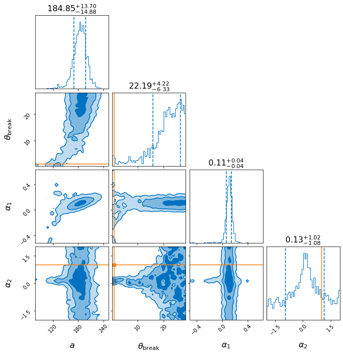

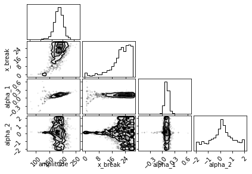

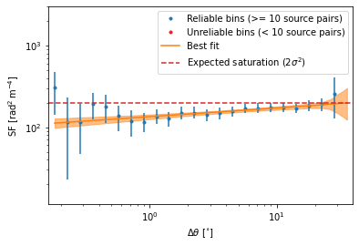

.. image:: example_files/example_11_6.png

.. code:: ipython3

    sf_result, result = structure_function(
        data=np.array(mao_rm_tab['RM'][mao_rm_tab['included']]) * u.rad / u.m**2,
        errors=np.array(mao_rm_tab['e_RM'][mao_rm_tab['included']]) * u.rad / u.m**2,
        coords=mao_rm_tab['coordinates'][mao_rm_tab['included']],
        samples=1000,
        bins=bins,
        show_plots=True,
        verbose=True,
        fit='bilby',
        nlive=400,
        sampler='nestle',
        model_name='power_law',
    )

.. parsed-literal::

    2022-11-07 14:04:07.099 INFO structurefunction - structure_function: Sampling errors...
    2022-11-07 14:04:09.998 INFO structurefunction - structure_function: Getting angular separations...
    2022-11-07 14:04:10.063 INFO structurefunction - structure_function: Computing SF...
    2022-11-07 14:04:32.609 INFO structurefunction - fit_data: Fitting SF with a power law...
    14:04 bilby INFO    : Running for label 'power_law_2_point', output will be saved to 'outdir'
    14:04 bilby INFO    : Search parameters:
    14:04 bilby INFO    :   amplitude = Uniform(minimum=-52.035011894175796, maximum=464.9494929780924, name='amplitude', latex_label='$a$', unit=None, boundary=None)
    14:04 bilby INFO    :   x_break = Uniform(minimum=0.179, maximum=28.371000000000002, name='x_break', latex_label='$\\theta_\\mathrm{break}$', unit=None, boundary=None)
    14:04 bilby INFO    :   alpha = Uniform(minimum=-2, maximum=2, name='alpha', latex_label='$\\alpha$', unit=None, boundary=None)
    14:04 bilby INFO    : Single likelihood evaluation took 1.576e-04 s
    14:04 bilby WARNING : Supplied argument 'npool' not an argument of 'Nestle', removing.
    14:04 bilby WARNING : Supplied argument 'sample' not an argument of 'Nestle', removing.
    14:04 bilby INFO    : Using sampler Nestle with kwargs {'method': 'multi', 'npoints': 400, 'update_interval': None, 'npdim': None, 'maxiter': None, 'maxcall': None, 'dlogz': None, 'decline_factor': None, 'rstate': None, 'callback': <function print_progress at 0x1b2e72550>, 'steps': 20, 'enlarge': 1.2}

.. parsed-literal::

    it=  3219 logz=-114.1911086409369

.. parsed-literal::

    14:04 bilby INFO    : Sampling time: 0:00:13.769841
    14:04 bilby INFO    : Summary of results:
    nsamples: 3620
    ln_noise_evidence:    nan
    ln_evidence: -113.771 +/-  0.124
    ln_bayes_factor:    nan +/-  0.124
    
    2022-11-07 14:04:47.401 INFO structurefunction - fit_data: Fitting results:
    2022-11-07 14:04:47.402 INFO structurefunction - fit_data: amplitude: 180 ± 20
    2022-11-07 14:04:47.403 INFO structurefunction - fit_data: x_break: 15 ± 9
    2022-11-07 14:04:47.404 INFO structurefunction - fit_data: alpha: 0.10 ± 0.04
    2022-11-07 14:04:47.406 INFO structurefunction - fit_data: Fit log evidence: -113.77116114103981 ± 0.1240670676073616

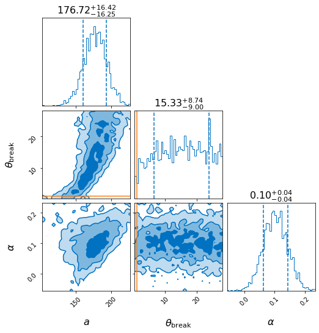

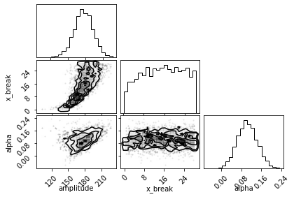

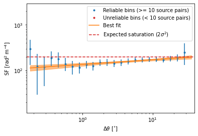

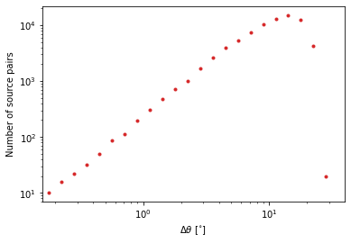

We can compare our results to those from the original paper.

.. code:: ipython3

    plt.figure(figsize=(6,6), facecolor='w')
    plt.plot(sf_result.c_bins, sf_result.med, '.', label='Median from MC')
    plt.errorbar(sf_result.c_bins, sf_result.med, yerr=[sf_result.err_low, sf_result.err_high], color='tab:blue', marker=None, fmt=' ', )#label = '16th to 84th percentile range')
    plt.plot(mao_sep, mao_sf, 'X', label='Paper SF')
    plt.xscale('log')
    plt.yscale('log')
    plt.ylim(10**1.5, 10**3)
    plt.xlim(10**-1,10**1.5)
    plt.legend()
    plt.xlabel(rf"$\Delta\theta$ [{mao_sep.unit:latex_inline}]")
    plt.ylabel(rf"RM SF [{mao_sf.unit:latex_inline}]")

.. parsed-literal::

    Text(0, 0.5, 'RM SF [$\\mathrm{rad^{2}\\,m^{-4}}$]')

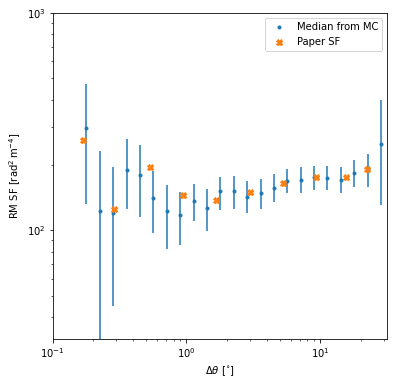

Finally, we extend to using mutli-point structure functions, as
described by Seta et al. 2022 (10.1093/mnras/stac2972). Currently, only
the triple-point structure function is implemented.

.. code:: ipython3

    sf_result, result = structure_function(
        data=np.array(mao_rm_tab['RM'][mao_rm_tab['included']]) * u.rad / u.m**2,
        errors=np.array(mao_rm_tab['e_RM'][mao_rm_tab['included']]) * u.rad / u.m**2,
        coords=mao_rm_tab['coordinates'][mao_rm_tab['included']],
        samples=1000,
        bins=bins,
        show_plots=True,
        verbose=True,
        fit='bilby',
        nlive=400,
        sampler='nestle',
        model_name='power_law',
        n_point=3
    )

.. parsed-literal::

    2022-11-07 14:04:53.006 INFO structurefunction - structure_function: Sampling errors...
    2022-11-07 14:04:55.827 INFO structurefunction - structure_function: Getting angular separations...
    2022-11-07 14:04:55.888 INFO structurefunction - structure_function: Computing SF...
    2022-11-07 14:05:06.528 INFO structurefunction - flush: Grouping triplets:   0%|          | 0/23 [00:00<?, ?it/s]
    2022-11-07 14:05:37.538 INFO structurefunction - flush: Grouping triplets:   4%|4         | 1/23 [00:31<11:22, 31.01s/it]
    2022-11-07 14:05:44.894 INFO structurefunction - flush: Grouping triplets:   9%|8         | 2/23 [00:38<05:59, 17.10s/it]
    2022-11-07 14:06:03.502 INFO structurefunction - flush: Grouping triplets:  13%|#3        | 3/23 [00:56<05:55, 17.79s/it]
    2022-11-07 14:06:03.826 INFO structurefunction - flush: Grouping triplets:  17%|#7        | 4/23 [00:57<03:26, 10.89s/it]
    2022-11-07 14:06:44.125 INFO structurefunction - flush: Grouping triplets:  26%|##6       | 6/23 [01:37<04:28, 15.80s/it]
    2022-11-07 14:06:45.784 INFO structurefunction - flush: Grouping triplets:  30%|###       | 7/23 [01:39<03:10, 11.92s/it]
    2022-11-07 14:06:49.229 INFO structurefunction - flush: Grouping triplets:  35%|###4      | 8/23 [01:42<02:22,  9.53s/it]
    2022-11-07 14:07:02.432 INFO structurefunction - flush: Grouping triplets:  39%|###9      | 9/23 [01:55<02:28, 10.58s/it]
    2022-11-07 14:07:56.236 INFO structurefunction - flush: Grouping triplets:  43%|####3     | 10/23 [02:49<05:00, 23.15s/it]
    2022-11-07 14:09:32.316 INFO structurefunction - flush: Grouping triplets:  48%|####7     | 11/23 [04:25<08:54, 44.56s/it]
    2022-11-07 14:11:19.801 INFO structurefunction - flush: Grouping triplets:  52%|#####2    | 12/23 [06:13<11:34, 63.15s/it]
    2022-11-07 14:13:00.834 INFO structurefunction - flush: Grouping triplets:  57%|#####6    | 13/23 [07:54<12:23, 74.39s/it]
    2022-11-07 14:14:16.764 INFO structurefunction - flush: Grouping triplets:  61%|######    | 14/23 [09:10<11:13, 74.85s/it]
    2022-11-07 14:14:17.652 INFO structurefunction - flush: Grouping triplets:  65%|######5   | 15/23 [09:11<07:02, 52.78s/it]
    2022-11-07 14:14:17.804 INFO structurefunction - flush: Grouping triplets:  70%|######9   | 16/23 [09:11<04:19, 37.05s/it]
    2022-11-07 14:14:34.125 INFO structurefunction - flush: Grouping triplets:  74%|#######3  | 17/23 [09:27<03:05, 30.85s/it]
    2022-11-07 14:14:34.246 INFO structurefunction - flush: Grouping triplets:  83%|########2 | 19/23 [09:27<01:06, 16.66s/it]
    2022-11-07 14:14:34.316 INFO structurefunction - flush: Grouping triplets: 100%|##########| 23/23 [09:27<00:00, 24.69s/it]
    2022-11-07 14:15:03.879 WARNING structurefunction - sf_three_point: Correcting for errors in three point SF
    2022-11-07 14:15:14.286 INFO structurefunction - fit_data: Fitting SF with a power law...
    14:15 bilby INFO    : Running for label 'power_law_3_point', output will be saved to 'outdir'
    14:15 bilby INFO    : Search parameters:
    14:15 bilby INFO    :   amplitude = Uniform(minimum=-225.72103067916134, maximum=1232.513427467522, name='amplitude', latex_label='$a$', unit=None, boundary=None)
    14:15 bilby INFO    :   x_break = Uniform(minimum=0.5660000000000001, maximum=28.371000000000002, name='x_break', latex_label='$\\theta_\\mathrm{break}$', unit=None, boundary=None)
    14:15 bilby INFO    :   alpha = Uniform(minimum=-2, maximum=2, name='alpha', latex_label='$\\alpha$', unit=None, boundary=None)
    14:15 bilby INFO    : Single likelihood evaluation took 9.887e-05 s
    14:15 bilby WARNING : Supplied argument 'npool' not an argument of 'Nestle', removing.
    14:15 bilby WARNING : Supplied argument 'sample' not an argument of 'Nestle', removing.
    14:15 bilby INFO    : Using sampler Nestle with kwargs {'method': 'multi', 'npoints': 400, 'update_interval': None, 'npdim': None, 'maxiter': None, 'maxcall': None, 'dlogz': None, 'decline_factor': None, 'rstate': None, 'callback': <function print_progress at 0x1b2e72550>, 'steps': 20, 'enlarge': 1.2}

.. parsed-literal::

    it=  2984 logz=-108.29771321747

.. parsed-literal::

    14:15 bilby INFO    : Sampling time: 0:00:07.572824
    14:15 bilby INFO    : Summary of results:
    nsamples: 3385
    ln_noise_evidence:    nan
    ln_evidence: -107.875 +/-  0.118
    ln_bayes_factor:    nan +/-  0.118
    
    2022-11-07 14:15:22.691 INFO structurefunction - fit_data: Fitting results:
    2022-11-07 14:15:22.692 INFO structurefunction - fit_data: amplitude: 590 ± 70
    2022-11-07 14:15:22.693 INFO structurefunction - fit_data: x_break: 16 ± 9
    2022-11-07 14:15:22.694 INFO structurefunction - fit_data: alpha: 0.16 ± 0.05
    2022-11-07 14:15:22.694 INFO structurefunction - fit_data: Fit log evidence: -107.874896434051 ± 0.11839303208862947

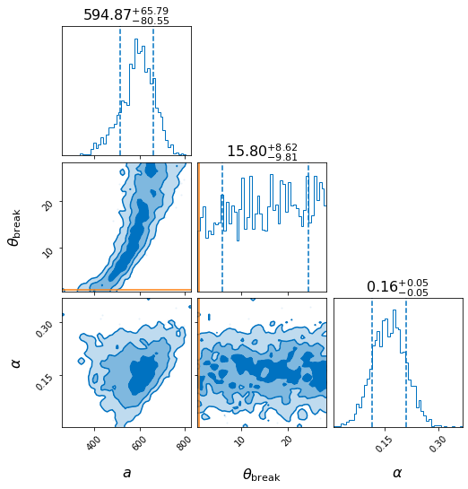

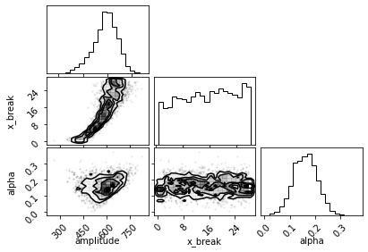

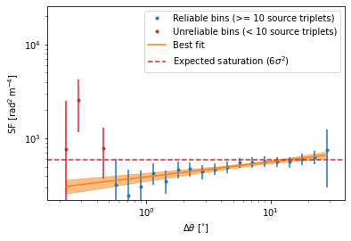

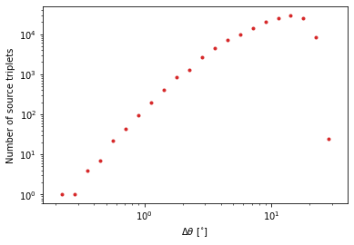

